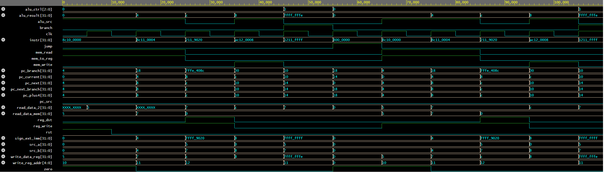

# 32-Bit Single-Cycle MIPS Processor (SystemVerilog)

A complete hardware implementation and verification of a 32-bit Single-Cycle MIPS CPU architecture developed in SystemVerilog. The processor executes core MIPS ISA instructions across classic 5-stage architectural boundaries (Fetch, Decode, Execute, Memory, Writeback).

## Architectural Overview

(Reference block diagram for the implemented Single-Cycle MIPS datapath)

* **Instruction Fetch (IF):** Program Counter (`pc`) register with synchronous updates, parallel adder calculating sequential execution targets (`PC + 4`), and word-aligned Instruction Memory (`imem`).
* **Instruction Decode (ID):** Dual-layer control decoding via `control_unit` and `alu_control`. Register File (`regfile`) supporting simultaneous asynchronous dual-reads and synchronous positive-edge writes, with `$zero` hardwired to 0. Sign extension preserving Two's Complement representation for 16-bit immediates.
* **Execute (EX):** Arithmetic Logic Unit (`alu`) supporting arithmetic, logical, and relational operations (`ADD`, `SUB`, `AND`, `OR`, `SLT`), accompanied by speculative parallel target address calculation for branch instructions (`PC + 4 + (Imm << 2)`).
* **Memory Access (MEM):** 64-word Data Memory (`dmem`) featuring word-aligned asynchronous reads and synchronous positive-edge writes.
* **Writeback (WB) & Next PC Selection:** Configurable Multiplexers routing ALU/Memory data to destination registers (`rt` vs. `rd`), and resolving Next PC selection among `PC + 4`, branch targets (`beq`), and direct pseudo-absolute jumps (`j`).

## Supported Instruction Set Architecture (ISA)

| Instruction | Type | Opcode | Funct | Description |
| :--- | :--- | :--- | :--- | :--- |
| `add` | R-Type | `000000` | `100000` | Add two registers |
| `sub` | R-Type | `000000` | `100010` | Subtract two registers |
| `and` | R-Type | `000000` | `100100` | Bitwise logical AND |
| `or`  | R-Type | `000000` | `100101` | Bitwise logical OR |
| `slt` | R-Type | `000000` | `101010` | Signed Set on Less Than |
| `lw`  | I-Type | `100011` | N/A    | Load Word from Data Memory |
| `sw`  | I-Type | `101011` | N/A    | Store Word to Data Memory |
| `beq` | I-Type | `000100` | N/A    | Branch on Equal |
| `j`   | J-Type | `000010` | N/A    | Unconditional Direct Jump |

## Verification & Simulation

The CPU and its underlying modules (ALU, Register File, etc.) were fully verified using testbenches and simulated to analyze waveforms. 

### Test Program Execution Flow
The system testbench pre-loads memory and executes a looping program:
1. `lw $s0, 0($0)`: Loads value `5` from Data Memory index 0 into `$s0`.
2. `lw $s1, 4($0)`: Loads value `7` from Data Memory index 1 into `$s1`.
3. `add $s2, $s0, $s1`: Computes $5 + 7 = 12$ (`0xC`) and writes back to `$s2`.
4. `sw $s2, 8($0)`: Stores result `12` into Data Memory index 2.
5. `beq $s0, $s1, -1`: Evaluates condition ($5 \neq 7$), branch is not taken.
6. `j 0`: Unconditionally loops back to address `0x00000000`.

### Simulation Waveforms
Below is the execution trace verifying clock synchronization, control assertion, and datapath values:

